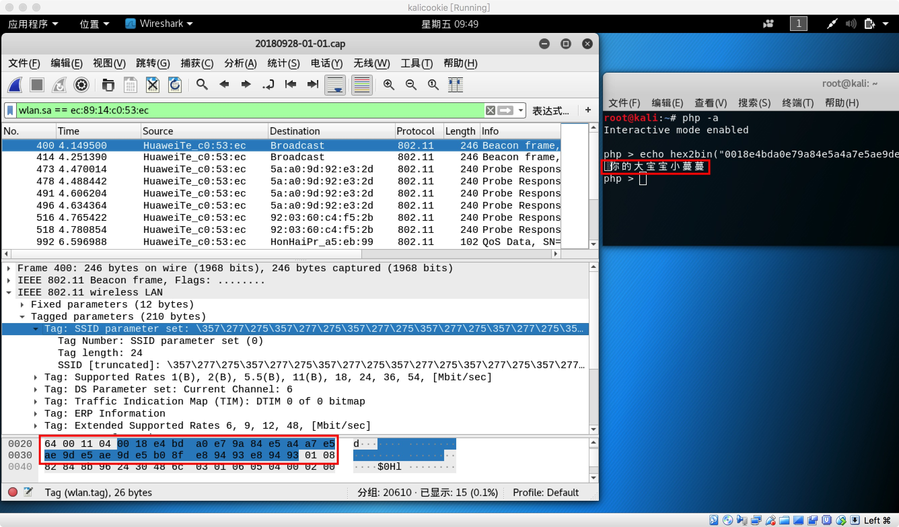

# 移动互联网安全-第二章-无线接入网监听-实验报告
## 一 、实验背景


## 二、实验过程
### 第一步、接入无线网卡
1. 查看所有活动（不包括被禁用）网卡`ifconfig`

    

2. 命令行下扫描附近的无线网络，注意自行替换wlan0为当前主机识别出的可用网卡;确保无线网卡的工作模式是managed，且Access Poit值为Not-Associated`iw dev wlan0 scan`
(需激活无线网络)

    
3. 仅查看附近无线网络的SSID`iw dev wlan0 scan | grep SSID`

    
4. 仅查看附近无线网络的SSID，自动处理UTF-8编码的SSID名称`iw dev wlan0 scan | grep SSID | xargs -0 echo -e`

    

### 第二步、设置网卡为监听模式
> 使用底层的网卡设置工具iw可以将该网卡设置为监听模式，并能正常使用airodump-ng进行无线抓包（支持channel hopping）。

```
iw dev wlan0 set monitor none
airodump-ng wlan0 --band a
airodump-ng wlan0
```


### 第三步、抓包并保存
        


>   - BSSID:表示无线ap的mac地址。
>   - PWR:网卡报告的信号水平，信号值越高，说明离ap或者计算机越近。
>    - Beacons:无线AP发出的通知编号。
>    - #Data：被捕获的数据分组数量#/s:过去10秒内每秒捕获的数据分组数量CH：信道号（从Beacons获取）
>    - MB:无线AP所支持的最大速率。如果MB=11，它是802.11b，如果MB=22，它是802.11b+, 如果更高是802.11g.后面的点（高于54之后）表明支持短前导码。‘e’表明网络中有Qos（802.11e）启用。
>   -    ENC：使用的加密算法体系。OPN表示无加密。WEP?表示WEP或者WPA/WPA2，WEP（没有问号）表明静态或动态WEP。如果出现TKIP或CCMP，那么就是WPA/WPA2。
>   -    CIPHER：检测到的加密算法，CCMP、WRAAP、TKIP、WEP、WEP104中的一个。典型的来说（不一定）、TKIP与WPA结合使用，CCMP与WPA2结合使用。如果密钥索引值大于0，显示为WEP40。
>   -    AUTH：使用的认证协议。常用的有MGT（WPA/WPA2使用独立的认证服务器，平时我们常说的有802.1x,radius,eap），SKA（WEP的共享密钥），PSK（WPA/WPA2的预共享密钥），PSK(WPA/WPA2的预共享密钥)，或者OPN(WEP开放式)。
>   -    ESSID:也就是所谓的SSID号。如果启用隐藏的SSID的话，它可以为空，或者显示为<lengthSTATION:客户端的MAC地址，包括连上的和想要搜索无线来连接的客户端。如果客户端没有连接上，就在BSSID下显示“not associated”。
>   -    Rate:表示传输率。
>   -    Lost:在过去10秒钟内丢失的数据分组，基于序列号检测。
>   -    Frames:客户端发送的数据分组数量。
>   -    Probe:被客户端查探的ESSID。如果客户端正试图连接一个AP，但是没有连接上，则将会显示到这里。

### 第四步、分析抓包
    
#### 数据统计：总共捕获20601个数据包
    
  
#### 数据整理：筛选出SSID

**1. 根据Beacon帧获得SSID**
        
```
tshark -r capture.cap -Y wlan.fc.type_subtype==0x08 -T fields -e wlan.sa -e wlan.fixed.capabilities.privacy -e wlan.ssid | sort -d -u > beacon.list

```
*beacon.list*      
```bash
00:27:1d:04:8d:be	0	CMCC-WEB
00:27:1d:04:91:63	0	CMCC-WEB
00:27:1d:04:9b:b9	0	CMCC-WEB
00:27:1d:04:9e:02	0	CMCC-WEB
00:27:1d:05:8d:be	1	CMCC
00:27:1d:05:91:63	1	CMCC
00:27:1d:05:9b:b9	1	CMCC
00:27:1d:05:9e:02	1	CMCC
00:27:1d:06:8d:be	0	and-Business
00:27:1d:06:9b:b9	0	and-Business
00:27:1d:06:9d:e2	0	and-Business
00:27:1d:06:9e:02	0	and-Business
06:74:9c:96:ce:1d	0	CUC-Guest
06:74:9c:96:ce:1e	0	CUC-Guest
06:74:9c:96:ce:5e	0	CUC-Guest
06:74:9c:96:ce:5f	0	CUC-Guest
06:74:9c:96:ce:77	0	CUC-Guest
06:74:9c:96:ce:78	0	CUC-Guest
06:74:9c:96:ce:9f	0	CUC-Guest
06:74:9c:96:ce:a0	0	CUC-Guest
06:74:9c:96:ce:cd	0	CUC-Guest
06:74:9c:96:ce:d2	0	CUC-Guest
06:74:9c:96:ce:d6	0	CUC-Guest
06:74:9c:96:ce:d7	0	CUC-Guest
06:74:9c:96:ce:ff	0	CUC-Guest
06:74:9c:96:cf:04	0	CUC-Guest
06:74:9c:96:cf:7b	0	CUC-Guest
06:74:9c:96:cf:7c	0	CUC-Guest
06:74:9c:96:d0:2f	0	CUC-Guest
06:74:9c:96:d0:30	0	CUC-Guest
06:74:9c:96:d0:43	0	CUC-Guest
06:74:9c:96:d0:44	0	CUC-Guest
06:74:9c:96:d0:57	0	CUC-Guest
06:74:9c:96:d0:58	0	CUC-Guest
06:74:9c:96:d0:75	0	CUC-Guest
06:74:9c:96:d0:76	0	CUC-Guest
06:74:9c:96:d0:93	0	CUC-Guest
06:74:9c:96:d0:94	0	CUC-Guest
06:74:9c:96:d0:bb	0	CUC-Guest
06:74:9c:96:d0:bc	0	CUC-Guest
06:74:9c:96:d0:c5	0	CUC-Guest
06:74:9c:96:d0:c6	0	CUC-Guest
06:74:9c:96:d0:d9	0	CUC-Guest
06:74:9c:96:d1:07	0	CUC-Guest
06:74:9c:96:d1:0b	0	CUC-Guest
06:74:9c:96:d1:0c	0	CUC-Guest
06:74:9c:97:65:bd	0	CUC-Guest
06:74:9c:97:65:cc	0	CUC-Guest
06:74:9c:97:66:11	0	CUC-Guest
06:74:9c:97:66:12	0	CUC-Guest
06:74:9c:97:66:62	0	CUC-Guest
06:74:9c:97:66:67	0	CUC-Guest
06:74:9c:97:66:94	0	CUC-Guest
06:74:9c:97:66:ad	0	CUC-Guest
06:74:9c:97:73:59	0	CUC-Guest
06:74:9c:97:73:5a	0	CUC-Guest
06:74:9c:97:73:73	0	CUC-Guest
06:74:9c:97:74:3f	0	CUC-Guest
06:74:9c:97:74:40	0	CUC-Guest
06:74:9c:97:74:99	0	CUC-Guest
06:74:9c:97:74:9a	0	CUC-Guest
06:74:9c:97:74:a4	0	CUC-Guest
06:74:9c:97:74:ad	0	CUC-Guest
06:74:9c:97:74:ae	0	CUC-Guest
06:74:9c:97:74:bd	0	CUC-Guest
06:74:9c:97:74:cb	0	CUC-Guest
06:74:9c:97:74:cc	0	CUC-Guest
06:74:9c:97:74:d5	0	CUC-Guest
06:74:9c:97:74:d6	0	CUC-Guest
06:74:9c:97:74:df	0	CUC-Guest
06:74:9c:97:74:e0	0	CUC-Guest
06:74:9c:97:74:f3	0	CUC-Guest
06:74:9c:97:74:f4	0	CUC-Guest
06:74:9c:97:74:fd	0	CUC-Guest
06:74:9c:97:74:fe	0	CUC-Guest
06:74:9c:97:75:11	0	CUC-Guest
06:74:9c:97:75:12	0	CUC-Guest
06:74:9c:97:75:1b	0	CUC-Guest
06:74:9c:97:75:1c	0	CUC-Guest
06:74:9c:97:75:2f	0	CUC-Guest
06:74:9c:97:75:30	0	CUC-Guest
06:74:9c:97:75:35	0	CUC-Guest
06:74:9c:97:75:3e	0	CUC-Guest
06:74:9c:97:75:3f	0	CUC-Guest
06:74:9c:97:75:61	0	CUC-Guest
06:74:9c:97:75:70	0	CUC-Guest
06:74:9c:97:75:71	0	CUC-Guest
06:74:9c:97:75:76	0	CUC-Guest
0a:74:9c:96:ce:1d	1	CUC-WiFi
0a:74:9c:96:ce:1e	1	CUC-WiFi
0a:74:9c:96:ce:5e	1	CUC-WiFi
0a:74:9c:96:ce:5f	1	CUC-WiFi
0a:74:9c:96:ce:77	1	CUC-WiFi
0a:74:9c:96:ce:78	1	CUC-WiFi
0a:74:9c:96:ce:9f	1	CUC-WiFi
0a:74:9c:96:ce:a0	1	CUC-WiFi
0a:74:9c:96:ce:cd	1	CUC-WiFi
0a:74:9c:96:ce:d2	1	CUC-WiFi
0a:74:9c:96:ce:d6	1	CUC-WiFi
0a:74:9c:96:ce:d7	1	CUC-WiFi
0a:74:9c:96:ce:ff	1	CUC-WiFi
0a:74:9c:96:cf:04	1	CUC-WiFi
0a:74:9c:96:cf:7b	1	CUC-WiFi
0a:74:9c:96:cf:7c	1	CUC-WiFi
0a:74:9c:96:d0:2f	1	CUC-WiFi
0a:74:9c:96:d0:30	1	CUC-WiFi
0a:74:9c:96:d0:43	1	CUC-WiFi
0a:74:9c:96:d0:44	1	CUC-WiFi
0a:74:9c:96:d0:57	1	CUC-WiFi
0a:74:9c:96:d0:58	1	CUC-WiFi
0a:74:9c:96:d0:75	1	CUC-WiFi
0a:74:9c:96:d0:76	1	CUC-WiFi
0a:74:9c:96:d0:8f	1	CUC-WiFi
0a:74:9c:96:d0:93	1	CUC-WiFi
0a:74:9c:96:d0:94	1	CUC-WiFi
0a:74:9c:96:d0:bb	1	CUC-WiFi
0a:74:9c:96:d0:bc	1	CUC-WiFi
0a:74:9c:96:d0:c6	1	CUC-WiFi
0a:74:9c:96:d0:d9	1	CUC-WiFi
0a:74:9c:96:d1:06	1	CUC-WiFi
0a:74:9c:96:d1:07	1	CUC-WiFi
0a:74:9c:96:d1:0b	1	CUC-WiFi
0a:74:9c:96:d1:0c	1	CUC-WiFi
0a:74:9c:97:65:bd	1	CUC-WiFi
0a:74:9c:97:65:cb	1	CUC-WiFi
0a:74:9c:97:65:cc	1	CUC-WiFi
0a:74:9c:97:66:11	1	CUC-WiFi
0a:74:9c:97:66:12	1	CUC-WiFi
0a:74:9c:97:66:62	1	CUC-WiFi
0a:74:9c:97:66:67	1	CUC-WiFi
0a:74:9c:97:66:93	1	CUC-WiFi
0a:74:9c:97:66:94	1	CUC-WiFi
0a:74:9c:97:66:ad	1	CUC-WiFi
0a:74:9c:97:73:59	1	CUC-WiFi
0a:74:9c:97:73:5a	1	CUC-WiFi
0a:74:9c:97:73:73	1	CUC-WiFi
0a:74:9c:97:74:3f	1	CUC-WiFi
0a:74:9c:97:74:40	1	CUC-WiFi
0a:74:9c:97:74:99	1	CUC-WiFi
0a:74:9c:97:74:9a	1	CUC-WiFi
0a:74:9c:97:74:a3	1	CUC-WiFi
0a:74:9c:97:74:a4	1	CUC-WiFi
0a:74:9c:97:74:ad	1	CUC-WiFi
0a:74:9c:97:74:ae	1	CUC-WiFi
0a:74:9c:97:74:bc	1	CUC-WiFi
0a:74:9c:97:74:bd	1	CUC-WiFi
0a:74:9c:97:74:cc	1	CUC-WiFi
0a:74:9c:97:74:d5	1	CUC-WiFi
0a:74:9c:97:74:d6	1	CUC-WiFi
0a:74:9c:97:74:e0	1	CUC-WiFi
0a:74:9c:97:74:f4	1	CUC-WiFi
0a:74:9c:97:74:fe	1	CUC-WiFi
0a:74:9c:97:75:11	1	CUC-WiFi
0a:74:9c:97:75:12	1	CUC-WiFi
0a:74:9c:97:75:1b	1	CUC-WiFi
0a:74:9c:97:75:1c	1	CUC-WiFi
0a:74:9c:97:75:2f	1	CUC-WiFi
0a:74:9c:97:75:30	1	CUC-WiFi
0a:74:9c:97:75:35	1	CUC-WiFi
0a:74:9c:97:75:3e	1	CUC-WiFi
0a:74:9c:97:75:3f	1	CUC-WiFi
0a:74:9c:97:75:70	1	CUC-WiFi
0a:74:9c:97:75:71	1	CUC-WiFi
0a:74:9c:97:75:76	1	CUC-WiFi
7e:5c:f8:41:0c:cb	1	DIRECT-WbDESKTOP-GM8P2C3msNP
be:e0:10:77:99:d5	1	DIRECT-DBASPIREmsEL
e4:0e:ee:e0:0c:13	1	HUAWEI P20
```

**2. 根据Probe Response获得SSID**
 ```
    tshark -r capture.cap -Y wlan.fc.type_subtype==0x05 -T fields -e wlan.sa -e wlan.fixed.capabilities.privacy -e wlan.ssid| sort -d -u > probres.list
```  
*probres.list*
```bash

00:27:1d:04:8d:be	0	CMCC-WEB
00:27:1d:04:91:63	0	CMCC-WEB
00:27:1d:04:9b:b9	0	CMCC-WEB
00:27:1d:04:9e:02	0	CMCC-WEB
00:27:1d:05:8d:be	1	CMCC
00:27:1d:05:91:63	1	CMCC
00:27:1d:05:9b:b9	1	CMCC
00:27:1d:05:9d:e2	1	CMCC
00:27:1d:05:9e:02	1	CMCC
00:27:1d:06:8d:ba	0	and-Business
00:27:1d:06:8d:be	0	and-Business
00:27:1d:06:9b:b9	0	and-Business
00:27:1d:06:9d:e2	0	and-Business
00:27:1d:06:9e:02	0	and-Business
06:74:9c:96:ce:5f	0	CUC-Guest
06:74:9c:96:ce:a0	0	CUC-Guest
06:74:9c:96:ce:cd	0	CUC-Guest
06:74:9c:96:ce:d6	0	CUC-Guest
06:74:9c:96:ce:ff	0	CUC-Guest
06:74:9c:96:cf:7b	0	CUC-Guest
06:74:9c:96:cf:7c	0	CUC-Guest
06:74:9c:96:d0:44	0	CUC-Guest
06:74:9c:96:d0:75	0	CUC-Guest
06:74:9c:96:d0:76	0	CUC-Guest
06:74:9c:96:d0:93	0	CUC-Guest
06:74:9c:96:d0:94	0	CUC-Guest
06:74:9c:96:d0:d9	0	CUC-Guest
06:74:9c:96:d1:0b	0	CUC-Guest
06:74:9c:97:65:cc	0	CUC-Guest
06:74:9c:97:66:11	0	CUC-Guest
06:74:9c:97:66:ad	0	CUC-Guest
06:74:9c:97:73:5a	0	CUC-Guest
06:74:9c:97:74:3f	0	CUC-Guest
06:74:9c:97:74:40	0	CUC-Guest
06:74:9c:97:74:99	0	CUC-Guest
06:74:9c:97:74:9a	0	CUC-Guest
06:74:9c:97:74:ad	0	CUC-Guest
06:74:9c:97:74:ae	0	CUC-Guest
06:74:9c:97:74:bd	0	CUC-Guest
06:74:9c:97:74:cc	0	CUC-Guest
06:74:9c:97:74:d5	0	CUC-Guest
06:74:9c:97:74:d6	0	CUC-Guest
06:74:9c:97:74:f4	0	CUC-Guest
06:74:9c:97:75:11	0	CUC-Guest
06:74:9c:97:75:12	0	CUC-Guest
06:74:9c:97:75:30	0	CUC-Guest
06:74:9c:97:75:3e	0	CUC-Guest
06:74:9c:97:75:3f	0	CUC-Guest
06:74:9c:97:75:71	0	CUC-Guest
0a:74:9c:96:ce:5f	1	CUC-WiFi
0a:74:9c:96:ce:a0	1	CUC-WiFi
0a:74:9c:96:ce:cd	1	CUC-WiFi
0a:74:9c:96:ce:d7	1	CUC-WiFi
0a:74:9c:96:ce:fe	1	CUC-WiFi
0a:74:9c:96:ce:ff	1	CUC-WiFi
0a:74:9c:96:cf:7b	1	CUC-WiFi
0a:74:9c:96:cf:7c	1	CUC-WiFi
0a:74:9c:96:d0:44	1	CUC-WiFi
0a:74:9c:96:d0:57	1	CUC-WiFi
0a:74:9c:96:d0:75	1	CUC-WiFi
0a:74:9c:96:d0:76	1	CUC-WiFi
0a:74:9c:96:d0:93	1	CUC-WiFi
0a:74:9c:96:d0:94	1	CUC-WiFi
0a:74:9c:96:d0:d9	1	CUC-WiFi
0a:74:9c:96:d0:da	1	CUC-WiFi
0a:74:9c:96:d1:07	1	CUC-WiFi
0a:74:9c:96:d1:0b	1	CUC-WiFi
0a:74:9c:97:65:bd	1	CUC-WiFi
0a:74:9c:97:65:cc	1	CUC-WiFi
0a:74:9c:97:66:11	1	CUC-WiFi
0a:74:9c:97:66:62	1	CUC-WiFi
0a:74:9c:97:66:67	1	CUC-WiFi
0a:74:9c:97:66:ad	1	CUC-WiFi
0a:74:9c:97:73:5a	1	CUC-WiFi
0a:74:9c:97:74:3f	1	CUC-WiFi
0a:74:9c:97:74:40	1	CUC-WiFi
0a:74:9c:97:74:99	1	CUC-WiFi
0a:74:9c:97:74:9a	1	CUC-WiFi
0a:74:9c:97:74:ad	1	CUC-WiFi
0a:74:9c:97:74:ae	1	CUC-WiFi
0a:74:9c:97:74:bc	1	CUC-WiFi
0a:74:9c:97:74:bd	1	CUC-WiFi
0a:74:9c:97:74:d5	1	CUC-WiFi
0a:74:9c:97:74:d6	1	CUC-WiFi
0a:74:9c:97:74:f3	1	CUC-WiFi
0a:74:9c:97:74:f4	1	CUC-WiFi
0a:74:9c:97:75:11	1	CUC-WiFi
0a:74:9c:97:75:12	1	CUC-WiFi
0a:74:9c:97:75:1b	1	CUC-WiFi
0a:74:9c:97:75:30	1	CUC-WiFi
0a:74:9c:97:75:3e	1	CUC-WiFi
0a:74:9c:97:75:3f	1	CUC-WiFi
0a:74:9c:97:75:70	1	CUC-WiFi
0a:74:9c:97:75:71	1	CUC-WiFi
7e:5c:f8:41:0c:cb	1	DIRECT-WbDESKTOP-GM8P2C3msNP
e4:0e:ee:e0:0c:13	1	HUAWEI P20
ec:89:14:c0:53:ec	1	������������������������
f0:b4:29:6d:b8:c2	1	Reference Room

```

**3. 将Beacon、Probe Response中的SSID进行合并，同名SSID只取一个**
        
```
   sort -m probres.list beacon.list | sort -k3 -u > ssid.list

```
*ssid.list*
```bash
ec:89:14:c0:53:ec   1   ������������������������
00:27:1d:06:8d:ba	0	and-Business
00:27:1d:05:8d:be	1	CMCC
00:27:1d:04:8d:be	0	CMCC-WEB
06:74:9c:96:ce:1d	0	CUC-Guest
0a:74:9c:96:ce:1d	1	CUC-WiFi
be:e0:10:77:99:d5	1	DIRECT-DBASPIREmsEL
7e:5c:f8:41:0c:cb	1	DIRECT-WbDESKTOP-GM8P2C3msNP
e4:0e:ee:e0:0c:13	1	HUAWEI P20
f0:b4:29:6d:b8:c2	1	Reference Room
```
**4. 处理文件中出现的字符串乱码**

ssid.list中mac地址为`ec:89:14:c0:53:ec`的WI-FI名称是以八进制UTF-8格式显示的，用十六进制流进行转码，转码使用php内建函数`hex2bin()`



**5. 用Wireshark分析capture.cap文件**

## 三、实验问题解答
- [x] **Q1: 查看统计当前信号覆盖范围内一共有多少独立的SSID？其中是否包括隐藏SSID？哪些无线热点是加密/非加密的？加密方式是否可知？**
1. 当前信号覆盖范围内一共有10个独立的SSID；


2. 在capture.cap中不包含隐藏的SSID，第二次抓包得到capture-01.cap，分析它的ssid2.list,中间包含一个隐藏的SSID，mac地址为：d6:ee:07:4b:45:ed。在Wireshark中找到；


3. Beacon帧的wlan.fixed.capabilities.privacy为1是加密，为0是未加密；


4. 认证帧的wlan.fixed.auth.alg为0是加密方式为OpenSystem，为1是加密方式SharedKey ；


- [x] **Q2: 如何分析出一个指定手机在抓包时间窗口内在手机端的无线网络列表可以看到哪些SSID？这台手机尝试连接了哪些SSID？最终加入了哪些SSID？**
1. 如何分析出一个指定手机在抓包时间窗口内在手机端的无线网络列表可以看到哪些SSID？

- 显示在手机端的无线网络列表的SSID有两种：一种是AP广播Beacon帧时携带的SSID；另一种是手机向曾经建立过连接的AP主动发送Probe Request帧，当这些AP回复Probe Response时，对应AP的SSID也会在手机端的无线网络列表中显示。

```
wlan.fc.type_subtype==0x0008
```


- 在ssid.list中查看对应mac地址的SSID,发现是CMCC-WEB


2. 这台手机尝试连接了哪些SSID？在手机等STA尝试连接的时候会向信号覆盖范围内的AP发送Probe Request帧，因此可以通过判断手机用户端向哪些AP发送了探测请求连接的Probe Request帧，从哪些AP接收了Probe Response帧来判断该手机端尝试连接了哪些SSID。 
```
 (wlan.fc.type_subtype==0x0005)&&(wlan.addr==特定手机的MAC地址）
```


3. 最终加入了哪些SSID？可以通过判断手机端收到了哪些AP(SSID)发送的Association Response帧判断该手机加入了哪些SSID 。

```
 (wlan.fc.type_subtype==0x0001)&&(wlan.addr==特定手机的MAC地址)
```


- [x] **Q3: SSID包含在哪些类型的802.11帧？**
    
三种：Beacon frame，Probe Response，Probe Request
            

## 四 实验总结
- 默认情况下无线网卡和无线接入点(Wireless Access Point,WAP)建立连接后,就处于托管模式(Managed mode),在这个模式下,无线网卡只专注于接受从 WAP 发给自己的数据报文。如果想让无线网卡监听空气中所有的无线通信,则可以将无线网卡设置成监听模式(Monitor mode,也叫 RFMON 模式),然后再使用诸如 Wireshark 之类的软件捕获数据报文进行分析。
- 在AP模式下，热点会不断定期地发送Beacon帧来宣告自己存在，告知设备可以加入网络；Probe Response帧是用于应答Probe Request帧，Probe Request帧是移动工作站用于扫描周围是否有网络所用
- WIFI攻击技术
    - 嗅探流量：攻击者将能够通过伪造去认证帧来强制发起新的认证过程，而这将导致你的设备跟热点之间出现短暂的掉线。
    - 接入流氓热点
    > 1.      手机获取已知WiFi网络的beacon帧，然后开始与距离最近（信号最强）的热点进行连接。
2.      手机给已知WiFi网络发送一个probe-request帧，可提供网络服务的接入点将响应一个probe-response帧。接下来，你的手机将会跟这个响应接入点进行连接。

    - 这里的问题就在于：任何设备都可以给任何网络发送beacon帧和probe-response帧。攻击者可以搭建一个便携式的流氓接入点，这个接入点不仅能够响应（probe-response）任何的probe-request帧，而且它们还能够给任何的目标网络发送beacon帧。
- 加密方式：
    - Open System:
这种鉴权方式不需要客户端提供任何credentials，因此，实际上任何客户端都可以尝试与AP进行鉴权和连接，这其中并不存在实际意义上的鉴权。鉴权连接结束，AP用WEP密钥加密数据，这时，客户端就需要正确的Password形成密钥来解密
    - Shared Key：
通过四次握手并使用WEP加密来完成鉴权。
- [无线渗透教程1：监听无线网络](https://blog.csdn.net/qq_39536876/article/details/80043542?utm_source=copy )