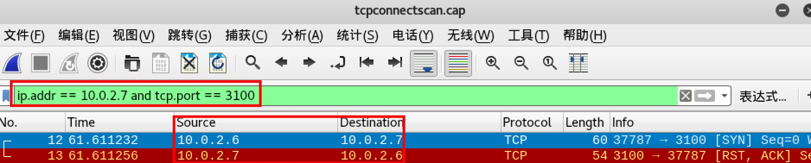
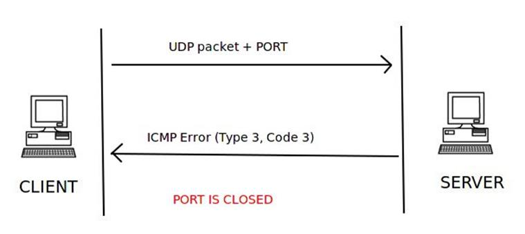

# 一、实验要求
## 自己动手编程实现并讲解：
- [ ] TCP connect scan
- [ ] TCP stealth scan
- [ ] TCP XMAS scan
- [ ] UDP scan
# 二、实验环境
- 攻击者主机名称：**KaliAttacker**(IP:10.0.2.6)
- 靶机主机名称：**KaliGateway**(IP:10.0.2.7)
# 三、实验过程
## TCP connect scan
> TCP connect is a three-way handshake between the client and the server. If the three-way handshake takes place, then communication has been established.
1. 在**KaliAttacker**执行`python '/root/桌面/tcpconnectscan.py`，同时在Kalitarget执行`tcpdump -i eth0 -w tcpconnectscan.cap`

    
    
    在**KaliAttacker**执行结果为`'The tcpflags:0x14.The port is closed', 3100`,表明靶机**KaliGateway**的3100端口关闭.
2. 开启靶机**KaliGateway**的3100端口：`mitmproxy -p 3100` ,在KaliAttackhost执行`python '/root/桌面/tcpconnectscan.py`

    
3. 在**KaliAttacker**上执行`nmap 10.0.2.7`

    
4. 在**KaliGateway**上用Wireshark分析抓到的包**tcpconnectscan.cap** 

    
    
5. 同理，对**KaliGateway**的80端口进行扫描
    
     

        
6. 结果分析：
- TCP connect端口扫描服务端与客户端建立连接成功（目标端口开放）的过程：
① Client端发送SYN；
② Server端返回SYN/ACK，表明端口开放；
③ Client端返回ACK，表明连接已建立；
④ Client端主动断开连接。

     
- TCP connect端口扫描服务端与客户端未建立连接成功（目标端口关闭）过程： 
① Client端发送SYN；
② Server端返回RST/ACK，表明端口未开放。

     
- 在**KaliAttacker**上使用`nmap`扫描**KaliGateway**时，由于3100端口非著名端口，即使**KaliGateway**中打开也没有在扫描结果中显示.
## TCP stealth scan
1. 在**KaliGateway**上打开80端口`mitmproxy -p 80`,然后执行`tcpdump -i -n eth0 -w tcpstealthscan.cap`;在**KaliAttacker**上执行    `tcpstealthscan.py`

     
2. 在**KaliAttacker**上执行`nmap 10.0.2.7`,验证80端口打开

     
3. 用Wireshark分析**KaliGateway**上抓到的包`tcpstealthscan.cap`

    
4. 结果分析：
- 端口开放：1、Client发送SYN  2、Server端发送SYN/ACK 3、Client发送RST断开（只需要前两步就可以判断端口开放）

    
- 端口关闭：1、Client发送SYN  2、Server端回复RST（表示端口关闭）

    
- 优点：SYN扫描要比TCP Connect()扫描隐蔽一些，SYN仅仅需要发送初始的SYN数据包给目标主机，如果端口开放，则相应SYN-ACK数据包；如果关闭，则响应RST数据包。
## XMAS scan
1. 在**KaliGateway**上打开80端口`mitmproxy -p 80`,然后执行`tcpdump -i -n eth0 -w xmasscan.cap`;在**KaliAttacker**上执行    `xmasscan.py`

     
2. 在**KaliAttacker**上执行`nmap 10.0.2.7`,验证80端口打开

     
3. 用Wireshark分析**KaliGateway**上抓到的包`xmasscan.cap`

    
4. 结果分析：
- 端口开放：1、Client发送Flags(FSH,FIN,URG)  2、Server端不发送任何消息 

    
- 端口关闭：1、Client发送Flags(FSH,FIN,URG)  2、Server端回复RST（表示端口关闭）

    
- 无法判断的情况：1、Client发送Flags(FSH,FIN,URG) 2、Server端回复error type为3 、 ICMP code为1, 2, 3, 9, 10, 13的数据包，表明端口被过滤，无法判断端口关闭还是开启
## UDP scan
1. 在**KaliGateway**上打开80端口`nc -ulp 80`,然后执行`tcpdump -i -n eth0 -w udpscan.cap`;在**KaliAttacker**上执行    `udpscan.py`

     

2. 用Wireshark分析**KaliGateway**上抓到的包`xmasscan.cap`

    
4. 结果分析：
- 端口开放：1、Client发送UDP packet 2、Server端发送UDP packet 

    
- 端口关闭：1、Client发送UDP packet 2、Server端回复ICMP Error(Type 3 Code 3)

    
- 无法判断的情况：1、Client发送UDP packet 2、Server端回复ICMP Error(Type 3 Code 1，2，9，10，13)

    
- 端口开放或者被过滤：1、Client发送UDP packet 2、Server端无回复

    
# 四、 实验代码
## tcpconnectscan. py
``` python
import sys
defaultencoding = 'utf-8'
if sys.getdefaultencoding() != defaultencoding:
    reload(sys)
    sys.setdefaultencoding(defaultencoding)


import logging
logging.getLogger("scapy.runtime").setLevel(logging.ERROR)

from scapy.all import *
dst_ip = "10.0.2.7"
src_port = RandShort()
dst_port = 80

pkt = IP(dst=dst_ip) / TCP(sport=src_port, dport=dst_port, flags="S")
pkt1 = IP(dst=dst_ip) / TCP(sport=src_port, dport=dst_port, flags="AR")
tcp_connect_scan_resp = sr1(pkt, timeout=10)

if (str(type(tcp_connect_scan_resp)) == "<type 'NoneType'>"):
    print("<type 'NoneType'>.The port is closed",dst_port)
elif (tcp_connect_scan_resp.haslayer(TCP)):
    if (tcp_connect_scan_resp.getlayer(TCP).flags == 0x12):
        send_rst = sr(pkt1, timeout=10)
        print("The tcpflags:0x12.The port is open",dst_port)
    elif (tcp_connect_scan_resp.getlayer(TCP).flags == 0x14):
        print("The tcpflags:0x14.The port is closed",dst_port)
```
## tcpstealthscan. py
``` python
import sys
defaultencoding = 'utf-8'
if sys.getdefaultencoding() != defaultencoding:
    reload(sys)
    sys.setdefaultencoding(defaultencoding)

import logging

logging.getLogger("scapy.runtime").setLevel(logging.ERROR)
from scapy.all import *

dst_ip = "10.0.2.7"
src_port = RandShort()
dst_port = 80

pkt = IP(dst=dst_ip) / TCP(sport=src_port, dport=dst_port, flags="S")
pkt1 = IP(dst=dst_ip) / TCP(sport=src_port, dport=dst_port, flags="R")

stealth_scan_resp = sr1(pkt, timeout=10)

if (str(type(stealth_scan_resp)) == "<type 'NoneType'>"):
    print("<type 'NoneType'>.The port is Filtered",dst_port)
elif (stealth_scan_resp.haslayer(TCP)):
    if (stealth_scan_resp.getlayer(TCP).flags == 0x12):
        send_rst = sr(pkt1, timeout=10)
        print("TCP FLAGS:0X12.The port is open",dst_port)
    elif (stealth_scan_resp.getlayer(TCP).flags == 0x14):
        print("TCP FLAGS:0x14.The port is closed",dst_port)
elif (stealth_scan_resp.haslayer(ICMP)):
    if (int(stealth_scan_resp.getlayer(ICMP).type) == 3 and int(stealth_scan_resp.getlayer(ICMP).code) in [1, 2, 3, 9, 10, 13]):
        print("ICMP error type:3.The port is Filtered",dst_port)
```
## xmasscan. py
``` python
import sys
defaultencoding = 'utf-8'
if sys.getdefaultencoding() != defaultencoding:
    reload(sys)
    sys.setdefaultencoding(defaultencoding)
import logging

logging.getLogger("scapy.runtime").setLevel(logging.ERROR)
from scapy.all import *

dst_ip = "10.0.2.7"
src_port = RandShort()
dst_port = 80

pkt = IP(dst=dst_ip) / TCP(dport=dst_port, flags="FPU")

xmas_scan_resp = sr1(pkt, timeout=10)
if (str(type(xmas_scan_resp)) == "<type 'NoneType'>"):
    print("<type 'NoneType'>.The port is open|The port is Filtered",dst_port)
elif (xmas_scan_resp.haslayer(TCP)):
    if (xmas_scan_resp.getlayer(TCP).flags == 0x14):
        print("TCP FLAGS:0x14.The port is closed",dst_port)
elif (xmas_scan_resp.haslayer(ICMP)):
    if (int(xmas_scan_resp.getlayer(ICMP).type) == 3 and int(xmas_scan_resp.getlayer(ICMP).code) in [1, 2, 3, 9, 10, 13]):
        print("ICMP error type:3.The port is Filtered",dst_port)
```
## udpscan. py
``` python
import sys
defaultencoding = 'utf-8'
if sys.getdefaultencoding() != defaultencoding:
    reload(sys)
    sys.setdefaultencoding(defaultencoding)
import logging

logging.getLogger("scapy.runtime").setLevel(logging.ERROR)
from scapy.all import *

dst_ip = "10.0.2.7"
src_port = RandShort()
dst_port = 80
dst_timeout = 10

udp_scan_resp = sr1(IP(dst=dst_ip) / UDP(dport=dst_port), timeout=dst_timeout)
if (str(type(udp_scan_resp)) == "<type 'NoneType'>"):
      print("The port is open|The packet is Filtered",dst_port)
elif (udp_scan_resp.haslayer(UDP)):
     print("The port is open",dst_port)
elif (udp_scan_resp.haslayer(ICMP)):
    if (int(udp_scan_resp.getlayer(ICMP).type) == 3 and int(udp_scan_resp.getlayer(ICMP).code) == 3):
         print("ICMP error type:3.The port is closed",dst_port)
    elif (int(udp_scan_resp.getlayer(ICMP).type) == 3 and int(udp_scan_resp.getlayer(ICMP).code) in [1, 2, 9, 10, 13]):
        print("ICMP error type:3.The port is open|The packet is Filtered",dst_port)
```
## 五、 参考实验报告
- [2018-NS-Public-MrCuihi](https://github.com/CUCCS/2018-NS-Public-MrCuihi/pull/8)

